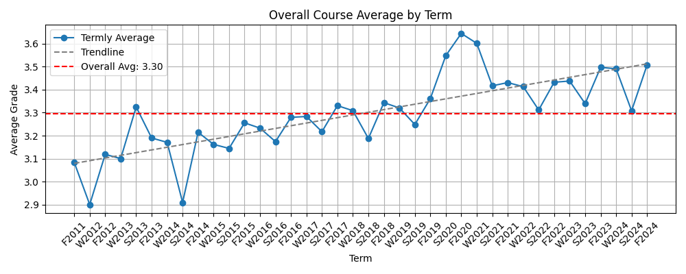
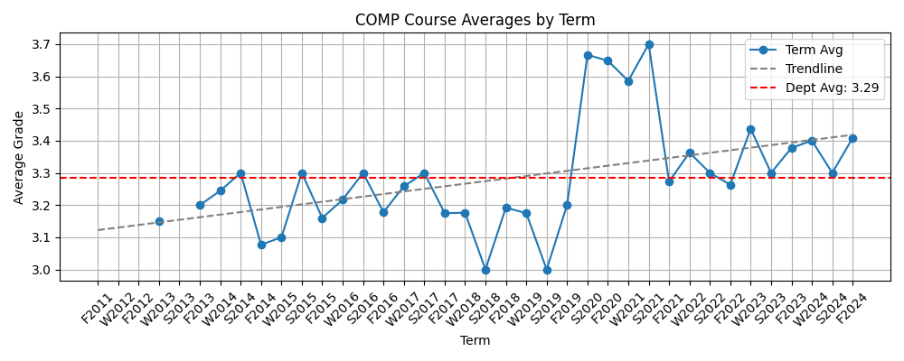
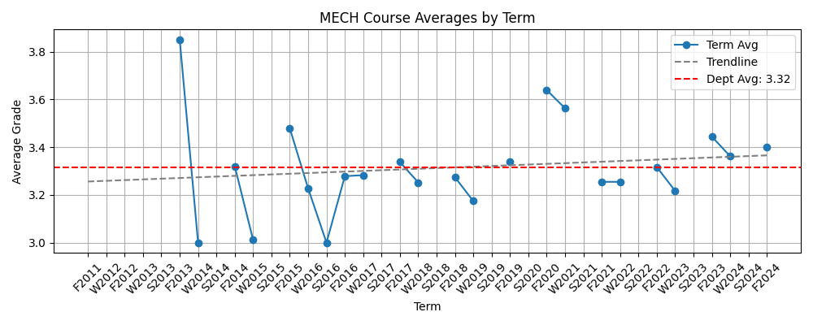

# Grade Inflation at McGill University

Is grade inflation at McGill real? [McGill Enhanced](https://github.com/demetrios-koziris/McGillEnhanced) crowdsources the course averages for many courses offered, so I run some visualization on it to see if grade inflation is actually happening.

## Methodology

I analyzed average course grades over time using data points grouped by term and department. For each term, I computed the average grade across all reported courses. I then generated trendlines using linear regression to identify any long-term patterns. Additionally, I broke down averages by department (e.g., COMP, MATH) to see if the trends were consistent across disciplines.

## Results

Over the past decade, the average course grade at McGill has increased by about 0.4 points, which is enough to push the average from an **B+ to an A-**. This consistent upward trend is strong evidence that grade inflation is happening.

Interestingly, during the COVID-19 era (2020–2021), average grades spiked by nearly two full grade boundaries, all the way an A-, likely due to more lenient grading and remote exams.

Some departments like COMP (Computer Science) closely follow the overall inflation trend:

Others, such as MECH (Mechanical Engineering), show a much flatter trend, suggesting more consistent grading standards:

## Data Disclaimer

Some departments have missing data for certain terms, so the analysis isn’t perfectly complete. The overall averages may be weighted more heavily toward terms with more available data, which can skew the results slightly. Interpret the trends with this limitation in mind.
